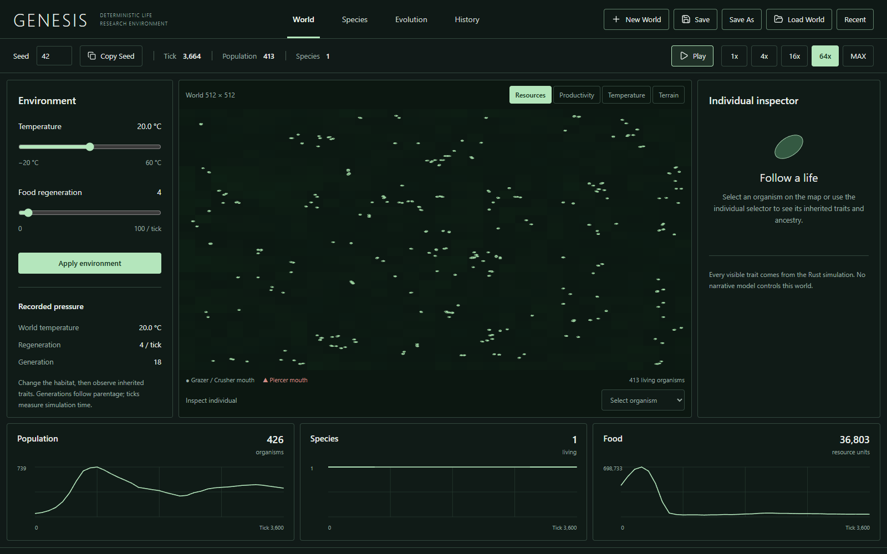
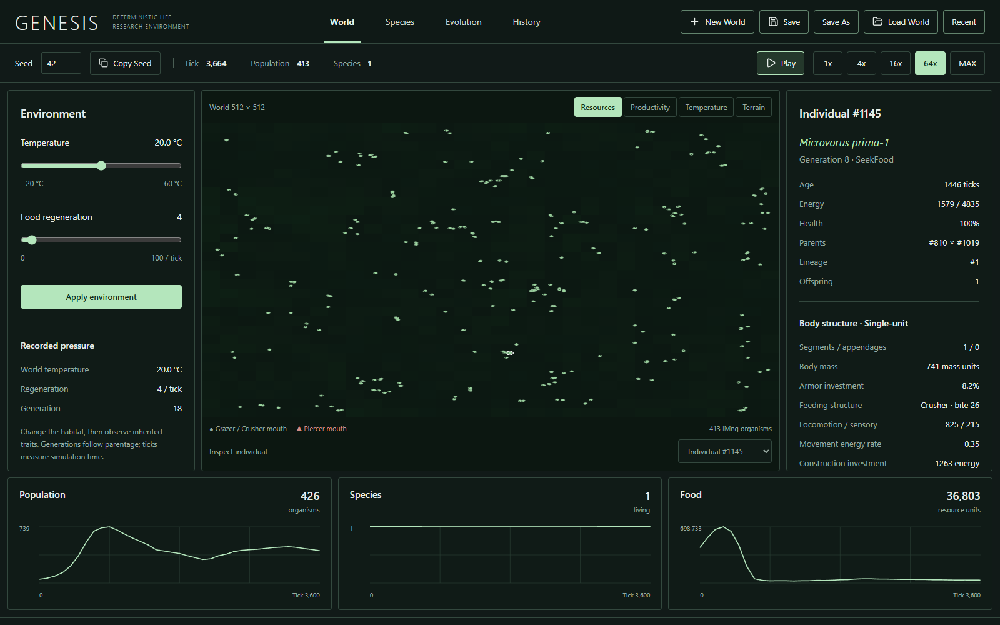
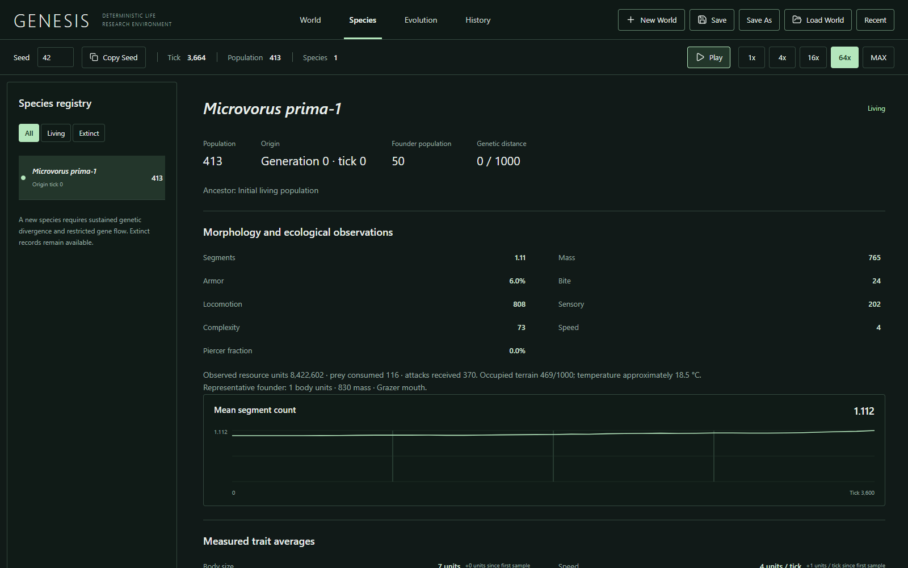
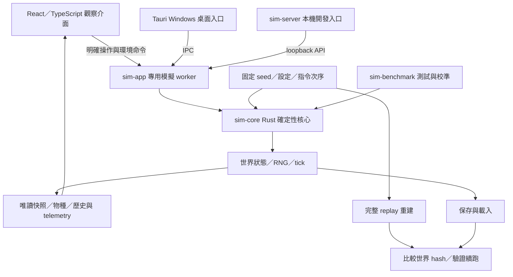

# GENESIS｜AI 生態箱

### 從單細胞出發，讓每一次演化都有可追溯的證據

GENESIS 是一個以 **Rust、Tauri 與 React** 建立的人工生命模擬研究原型。個體的移動、攝食、能量消耗、繁殖與遺傳由模擬規則決定；介面讓使用者觀察性狀、親代、物種與歷史紀錄。

這個專案關注兩個問題：**演化現象如何從局部規則產生？我們如何確認看到的結果可以重現，而不是展示腳本或敘事生成？**



> 圖片來自 `phase2/multicellular-ecology` 分支的實際瀏覽器開發模式，使用相同 Rust application worker；固定 seed 42、simulation v5。它不是設計稿，也不是已完成驗收的 Phase 2 原生安裝版。本文中的介面截圖是短程觀察，不代表已形成穩定複雜生態。

## 專案目前在哪裡？

| 入口 | 內容與驗收狀態 |
| --- | --- |
| [`main`](https://github.com/oliverchenOVO/genesis-ecosystem/tree/main) | Phase 1／1.1、simulation v4；保留既有程式與已驗收基準 |
| [Release v0.1.0](https://github.com/oliverchenOVO/genesis-ecosystem/releases/tag/v0.1.0) | Phase 1／1.1 的 Windows 發佈與驗證紀錄 |
| [`phase2/multicellular-ecology`](https://github.com/oliverchenOVO/genesis-ecosystem/tree/phase2/multicellular-ecology) | simulation v5 的形態、生態與診斷研究；**PHASE 2 INCOMPLETE** |

這個 repository 保留原始 commit history、既有 Releases 與 Actions 紀錄，供審閱者追蹤專案的演進。最新研究工作仍位於 Phase 2 分支，未為公開展示而合併進 `main`。

## 我們如何觀察演化？

### 1. 改變環境，觀察規則產生的結果

使用者可以設定 seed、世界大小、初始族群與環境，控制模擬播放速度，觀察族群與資源如何改變。播放速度影響實際執行速率，不改變 tick 的定義。環境命令被記錄，供 replay 重建。

### 2. 從個體回溯性狀與親代



> 同一 Phase 2 實際世界，seed 42、tick 3664；右側顯示被選取個體的能量、親代、體型與攝食結構。下方曲線取自已收集的 telemetry，因此最新曲線樣本與即時世界 tick 可以不同。

### 3. 把物種當成紀錄，而不是預先安排的角色



> 此短程世界仍只有初始物種。物種頁面呈現已記錄的來源與統計，沒有為了截圖強制產生新物種。自然物種分化可能需要許多世代，也可能不發生。

## 系統架構：Rust 決定世界，介面呈現證據



- **單一世界真相**：桌面與 headless 測量使用同一 Rust 核心；圖表與分析不修改世界狀態。
- **可重現性**：固定 seed、初始設定與指令次序，透過 golden、save/load、完整 replay 與續跑檢查。
- **模擬與渲染分離**：介面更新頻率不決定生物的行為或 tick 次序。
- **LLM 不在核心 loop**：AI 用於開發協作，沒有在運行時決定世界狀態或編造演化事件。

詳細設計：[架構](docs/ARCHITECTURE.md) · [Determinism](docs/DETERMINISM.md) · [保存格式](docs/SAVE_FORMAT.md) · [Replay](docs/REPLAY.md)

## 可檢查的成果與研究限制

| 階段 | 已保存的工程／實驗證據 | 解讀限制 |
| --- | --- | --- |
| Phase 1／1.1 | Rust 42、前端 21 項測試通過；250 seeds × 100000 ticks，250/250 存活、32 個世界自然物種分化 | 族群受 hard cap 飽和影響，不能當成豐富生態的充分證據 |
| Phase 1／1.1 | 原生操作、保存／載入、dirty guards、replay 與 installer 驗收紀錄 | 驗收針對 v0.1.0，不延伸成 Phase 2 的產品驗收 |
| R3 正式校準 | 100 seeds × 100000 ticks；100/100 save/load、完整 replay 與續跑驗證通過 | 四項生態驗收門檻仍為 0/100 |
| R4 有界實驗 | 控制組與四個候選共 40 個世界，40/40 重現驗證通過 | 四個候選均失去持續多細胞存活，因此沒有採用 |
| R4 工程回歸 | Rust normal 75／all features 84、前端 24、Node 26 通過 | 測試通過不等於複雜生態目標已完成；效能波動仍待釐清 |

Phase 1 的數字來自 [Phase 1.1 報告](docs/PHASE1_1_REPORT.md)，R3／R4 的定義、來源與拒絕理由見 [Phase 2 完整報告](https://github.com/oliverchenOVO/genesis-ecosystem/blob/phase2/multicellular-ecology/docs/PHASE2_REPORT.md)。不同版本、族群上限與實驗條件的結果不能直接互相比較。

失敗的候選也被保留：增加資源場尺度或提高捕食能量回收，並沒有建立符合門檻的穩定複雜生態。下一步應根據保存的飲食時間窗、資源空間結構、能量與配偶可得性提出有界假設，而不是降低門檻或強制產生結果。

## 在本機執行

Windows 開發環境需要 Rust 1.99.0、Microsoft C++ Build Tools 與 Windows SDK、WebView2、Node 24、pnpm 11.19.0。

```powershell
git clone https://github.com/oliverchenOVO/genesis-ecosystem.git
cd genesis-ecosystem
pnpm install --frozen-lockfile
pnpm tauri dev
```

以上預設取得 `main` 的 v4 基準。若要檢查本文 Phase 2 截圖所屬程式，先執行 `git switch phase2/multicellular-ecology`，再依該分支說明安裝與啟動。v4 保存檔與 v5 不相容，請使用對應版本。

瀏覽器開發模式需開兩個終端：

```powershell
# 終端一：真實 Rust worker 的本機 API
cargo run -p sim-server

# 終端二：前端
pnpm dev
```

開啟 `http://127.0.0.1:1420`。這個 loopback adapter 僅供開發／測試，不是公開網站後端，也不包含在 Windows 桌面產品中。

## 測試與重現

```powershell
cargo test --release --workspace --locked
cargo clippy --workspace --all-targets --locked -- -D warnings
cargo fmt --all -- --check
pnpm format:check
pnpm lint
pnpm typecheck
pnpm test
pnpm build
cargo run --release -p sim-benchmark -- --seed 11 --ticks 50000 --population 50 --limit 200
```

Windows 可執行 `scripts/validate.ps1`。建置 review installer 時使用獨立 target 目錄，以保留既有基準產物。最新實際 CI 狀態請查看 [GitHub Actions](https://github.com/oliverchenOVO/genesis-ecosystem/actions)，不要僅依 README 中歷史測量推斷新 commit 已通過。

## AI 協作、個人貢獻與授權

本專案使用 Codex 協助實作、除錯、測試、benchmark、診斷與文件整理。使用者指定研究方向與驗收約束，開發產物透過測試、原始實驗證據與 CI 檢查。這不代表全部程式由作者獨立手寫；個人貢獻與熟悉程度應由作者依實際參與說明。參見 [AI 協作揭露](docs/AI_COLLABORATION.md)。

本 repository 用於技術交流、研究所推甄與作品展示；模型不是科學預測工具。尚未選定專案 LICENSE，公開可見性不等同授予開源再利用權利。第三方套件與資產仍各自適用其授權。

審閱入口：[完整 commit history](https://github.com/oliverchenOVO/genesis-ecosystem/commits/main/) · [Releases](https://github.com/oliverchenOVO/genesis-ecosystem/releases) · [Actions](https://github.com/oliverchenOVO/genesis-ecosystem/actions) · [Phase 2 分支歷史](https://github.com/oliverchenOVO/genesis-ecosystem/commits/phase2/multicellular-ecology/)
