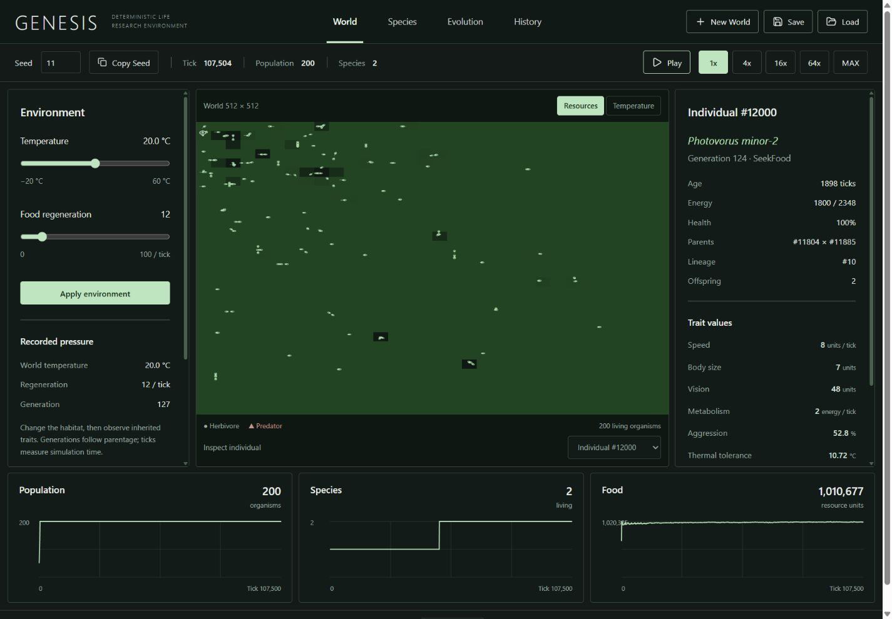
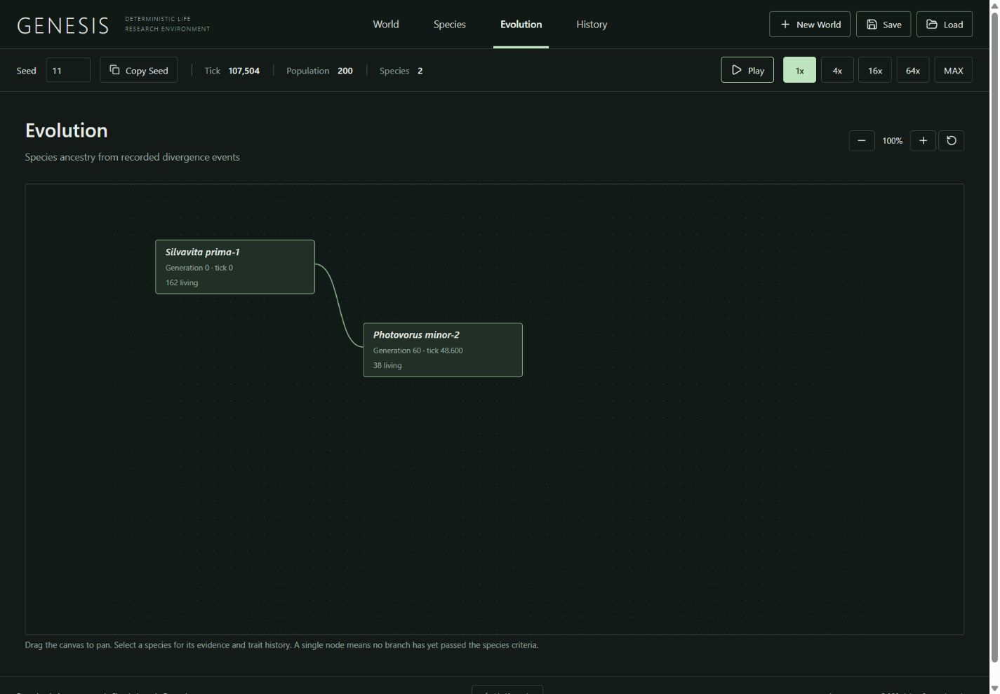

# Phase 1 驗收報告

日期：2026-10-03。版本：GENESIS 0.1.0；simulation v4、RNG v1、save format v1。

本機 Phase 1 的 build、tests、穩定性、核心 simulation、UI、persistence 與 Windows 啟動基本驗收已通過，可以直接進行使用者驗收。沒有進入 Phase 2、沒有 LLM simulation loop，也沒有 push。原目錄為空且沒有 Git remote；目前維持本地 repository，沒有建立任何公開或私人遠端。

## 完成內容

- Rust 權威核心：固定 seed、整數運算、獨立且可保存的 RNG streams、固定 tick pipeline、穩定 ID/order 與 canonical world hash。
- 14 個 haploid loci、genome/phenotype 分離、性狀成本、資源消耗、代謝、溫度壓力、utility 行為、真實捕食傷害與死亡。
- 兩親代繁殖、crossover、bounded mutation、實際世代、永久親代/死亡記錄、lineage、持續分化與 gene-flow 門檻、物種命名及永久滅絕記錄。
- 完整 binary save、壓縮/checksum/版本/大小及 state 驗證、atomic replacement、三個輪替 autosave、保存後續跑與 command replay。
- 獨立 Rust worker、Tauri IPC、Windows executable/NSIS package、開發用 loopback adapter。TypeScript 只顯示資料與送出命令。
- World、個體 inspector、Species、Evolution、History、真實 telemetry charts、固定 seed 建立世界、容量設定、環境介入與播放速度。
- CI workflow、可重跑的 Windows validation script、架構/模型/版本文件、完整 benchmark 證據與可載入的實際示範存檔。

預設 habitat 使用 50 個 founders、capacity 200；容量仍可設定到 5000。這是完整壓力測試支持的保守參數選擇，沒有限制原本的 2000 個體 benchmark，也沒有強迫生物存活。

## 測試與驗收結果

| Gate | 結果與證據 |
|---|---|
| Rust release build | PASS：sim-core、sim-app、sim-benchmark、sim-server |
| Windows Tauri build | PASS：`pnpm tauri build`，產生 executable 與 x64 NSIS package |
| Frontend production build | PASS；主 JS 253.28 kB，gzip 79.33 kB |
| Rust tests | 32 PASS：26 core、4 golden/version、1 worker integration、1 Tauri IPC integration |
| Frontend tests | 8 PASS：設定驗證、個體選取、譜系排序、history、charts、單位與事件分類 |
| Lint/typecheck/format | PASS：clippy `-D warnings`、rustfmt、ESLint、tsc、Prettier |
| 完整穩定性 | 100 seeds × 50,000 ticks，全部通過；定期 state validation、save/load continuation、完整 replay |
| Save/replay | PASS；golden 有 6 個固定 checkpoint；v1/v2/v3 明確拒絕 |
| Windows 啟動 | PASS；主視窗可回應、packaged page 載入、worker 回傳 v4 真實初始世界 |

最後也實際執行 `scripts/validate.ps1`，所有檢查及三個 benchmark 通過。此 script 對非零 exit code 立即失敗，輸出放在 ignored `artifacts/`。`-Package` 加跑 Windows 包；`-FullStress` 加跑完整 100-seed gate。

Tauri IPC 測試使用 MockRuntime 與實際 Rust worker，驗證 command routing、環境命令、不合法速度拒絕及 replay。原生 Windows 啟動另行驗證；瀏覽器 UI 直接連到相同 worker。原生視窗內的逐鍵自動操作沒有執行，使用者可在成品做最後的原生 UX 驗收。

## Benchmark

環境：Windows 11 10.0.26200、Intel i9-12900H（14 cores / 20 logical processors）、Rust 1.99.0、MSVC 17.14.41。以下是完整 stress 結束後的 release 測量，未同時執行長期壓力工作。

| 情境 | ticks | 起始 / 上限 | 時間 | ticks/s | 有生物的 ticks | 平均 / 最終族群 | 物種 |
|---|---:|---:|---:|---:|---:|---:|---:|
| seed42 小型 | 10,000 | 500 / 2000 | 3.965 s | 2,522 | 2,515 | 155.30 / 0 | 1 |
| seed42 中型 | 50,000 | 2000 / 2000 | 5.455 s | 9,166 | 2,264 | 33.37 / 0 | 1 |
| seed11 持續生態 | 50,000 | 50 / 200 | 17.194 s | 2,908 | 50,000 | 199.24 / 200 | 2 |

前兩個情境實際滅絕，其後包含大量空世界 ticks，不能用其 ticks/s 宣稱持續高族群性能。第三個情境全程有生物，包含 6,073 次出生、5,923 次死亡、4,854 個 mutated loci 與真實自然分化。CLI 另外記錄 exact organism-ticks；原始 JSON 在 `benchmarks/final-*.json`。

完整 v4 stress：100 seeds（0–99）、每個 50,000 ticks、50 founders/capacity 200、5 種記錄的溫度介入、4 workers，耗時 1462.10 秒。crash/panic/invalid state/save corruption/replay mismatch 為 0；100 個世界仍存活，9 個形成第二物種，共 608,836 次出生、593,836 次死亡。每個 seed 都做中途 binary roundtrip、後續 hash 比對與從 seed/commands 重建的 replay。v3/v4 的生態結果逐 seed 相同，符合 v4 只新增永久 origin-generation metadata 的預期。完整 JSON 與 summary 均保留。

## 實際 UI 證據

seed11 的 UI 世界在 tick 48,600 自然形成 Photovorus minor-2：origin generation 60、16 個 founders、距祖先 118/1000。運行到 tick 107,504 時仍有 200 個個體與兩物種。個體 #12000 為 generation 124，親代為 #11804 × #11885；這些資料全部來自 Rust。

實測 New World/seed/capacity、play/pause/speeds/MAX、個體檢視、Species filter/detail、Evolution zoom/reset/node navigation、History、溫度鍵盤介入、Save/Load/replay。1440×1000、1024×768、390×844 無水平溢出；最後重新連線的 QA 期間 browser error/warning 為空。

60°C 且無食物的介入讓兩物種在 tick 107,538、107,595 實際滅絕；Extinct filter 與永久 History 都正確顯示。Load 隨後恢復先前保存的 tick 107,504、200 個體與兩物種。三個真正產生的 autosave 均可載入，其中一個保存了滅絕後的世界，並未製造假的復活。

107,504 ticks 的完整 replay 與保存世界 hash 一致：

`9942ea1d1033f6db883e6830aa5489bf457db646eb3493a8139ffa54f28f659a`

原始證據：`benchmarks/long-replay-v4.json`、`autosave-smoke-v4.json`、`desktop-smoke-v4.json`；截圖：`UI_DESKTOP.png`、`UI_EVOLUTION.png`、`UI_MOBILE.png`。

## Git commits

| Commit | 內容 |
|---|---|
| `9cce2cc` | deterministic core、persistence、replay、benchmark 與初始文件 |
| `94449d6` | hunger gate、捕食傷害/成本/cooldown 與 regression |
| `2ea133b` | 每個 locus 的 mating compatibility 與 dietary conversion |
| `2e8c261` | 損壞 chronology/registry 驗證與 mandatory final replay checkpoint |
| `69ad104` | 永久物種起源世代、v4 golden、occupied workload 記錄 |
| `3a6e6bc` | 完整 research station 前端與 8 項邏輯測試 |
| `cf61de8` | worker、IPC、autosave、Windows Tauri package 與整合測試 |

後續 validation/report/CI 與 generated-file 清理提交可用 `git log --oneline` 查看。只提交本地；最終工作樹以 `git status --short` 確認。

## 技術問題與限制

- 原環境沒有 Rust/MSVC；官方安裝與下載曾卡住。已完成正常 Rust/MSVC 安裝；早期官方套件 fallback 留在 ignored `.tools/`，不進 repository。
- Cargo HTTP/2 proxy 下載卡住：停用 HTTP multiplexing，保留 HTTPS/checksum。TypeScript/parser 相容性以 5.9.3 固定解決。
- Windows 不允許覆寫執行中的 exe：benchmark 使用暫時 target directory 隔離，server 停止後重建；最終 release build 已通過。
- 多餘平台圖示的清除遭自動審核阻擋，回覆只有政策阻擋、沒有細節；保留工具產生的圖示，不影響 Windows 包。Tauri generated schemas 留在磁碟並從 Git 排除。
- 高容量 habitat 仍可能整體滅絕，尚未校準到持續大型族群。物種分類是明確的 artificial-life heuristic。
- UI 使用一個 manual slot；autosave recovery 沒有檔案選擇介面。UI seed 輸入限定 JavaScript safe integer，核心/CLI/save 支援完整 u64。
- Phase1 不做舊版本 save migration；replay 限 10,000,000 ticks、save 限 128 MiB。
- GitHub Actions workflow 已建立，但沒有 remote/push，未宣稱遠端 CI 執行成功。NSIS 包已產生；本機直接 executable 啟動通過，沒有另外執行安裝程式。

沒有阻塞中的 Phase1 必要功能；以上限制保留為後續維護項目。

## 直接驗收與下一步

執行 `target/release/genesis-desktop.exe`，或使用 `target/release/bundle/nsis/GENESIS_0.1.0_x64-setup.exe`。建立 seed11、50 founders/capacity200 的世界，使用 MAX 觀察自然分化；可保存後介入環境，再 Load 恢復。

`examples/seed11-107504.genesis` 是上述實際長世界，附 manifest/checksum。若要用目前的 manual-slot UI 載入它，先保存自己的世界，再將示範檔複製到 Save 結果顯示的 `manual.genesis` 位置。Windows 預設位於 `%APPDATA%/local.genesis.ecosystem/worlds/`。

下一步先完成原生使用者驗收；其後在 Phase1 模型範圍內校準高密度能量/捕食收支，並考慮增加 manual/autosave 檔案選擇。Phase2 尚未開始。
